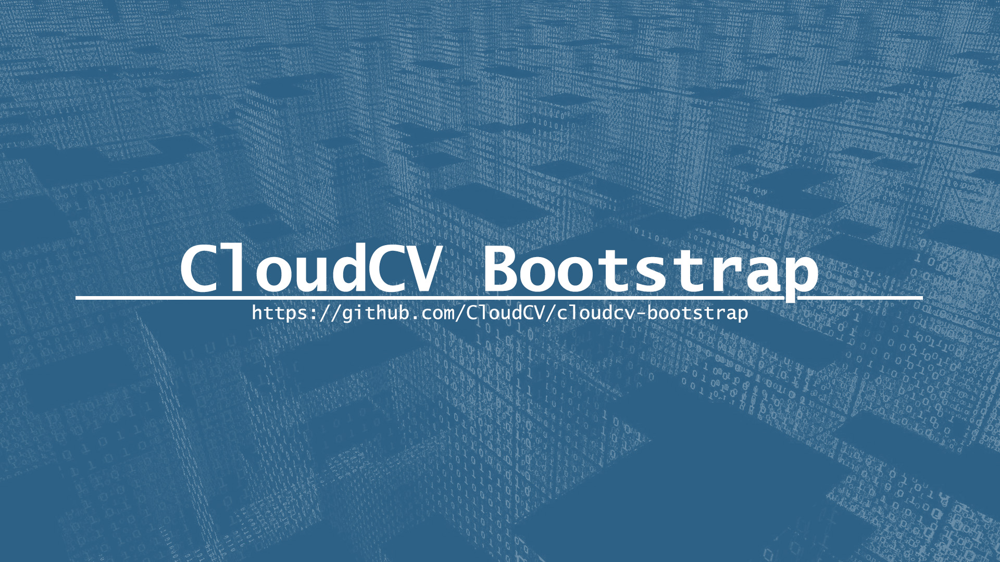
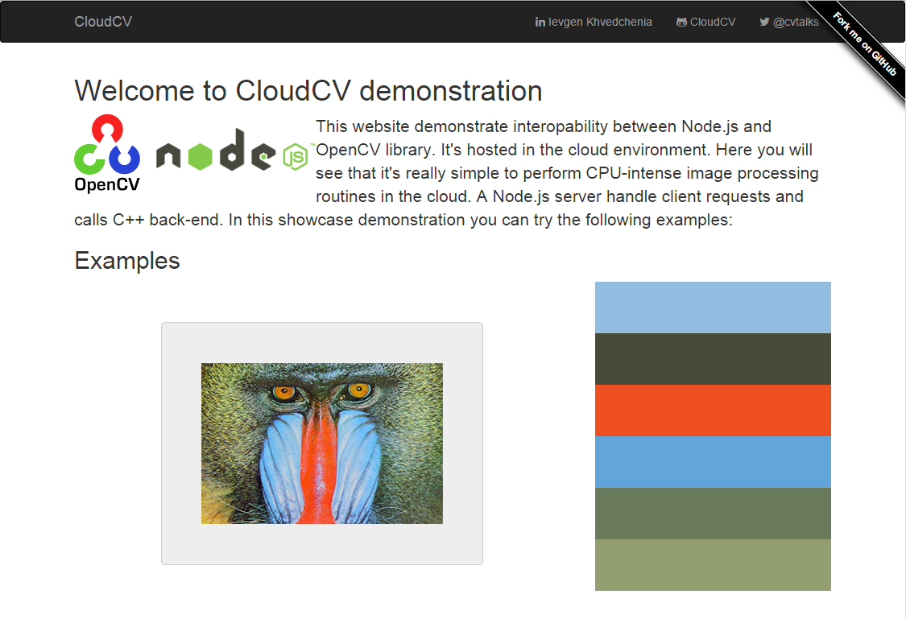

# CloudCV Bootstrap



**A starter template for Node.js with OpenCV bindings**.

[](https://travis-ci.org/CloudCV/cloudcv-bootstrap)

This project lets you to quickly prototype a REST API in a Node.js for a image processing service written in C++. 

## Installation

```bash
# Get the latest snapshot 
$ git clone —depth=1 https://github.com/CloudCV/cloudcv-bootstrap.git myproject
$ cd myproject 
$ git remote rm origin 

# Install NPM dependencies 
$ npm install

# Start local server
$ npm start
```

After starting local webserver, navigate to http://localhost:3000 where you should see similar page:



Here you can drop arbitrary image to extract dominant colors using REST-API. 

## Quick start

```bash
npm start
```

## Unit testing

```bash
npm test
```

## Questions?

Explore the series of blog posts:
 1. http://computer-vision-talks.com/articles/introducing-cloudcv-bootstrap/
 2. http://computer-vision-talks.com/articles/how-to-convert-args-from-js-to-cpp/
 3. http://computer-vision-talks.com/articles/2013-09-05-cloudcv/
 4. http://computer-vision-talks.com/articles/2013-08-27-connecting-opencv-and-node-js-inside-cloud9-ide/
 5. http://computer-vision-talks.com/articles/2013-08-19-cloud-image-processing-using-opencv-and-node-js/

CloudCV bootstrap is free software/open source, and is distributed under the [BSD license](http://opensource.org/licenses/BSD-3-Clause). It contains third-party code, see the included `third-party.txt` file for the license information on third-party code.

CloudCV bootstrap is created and maintained by [Eugene Khvedchenya](http://computer-vision-talks.com) (Twitter: [@cvtalks](http://twitter.com/cvtalks)). Follow the official Twitter stream [@cvtalks](http://twitter.com/cvtalks) to get the frequent development updates.
